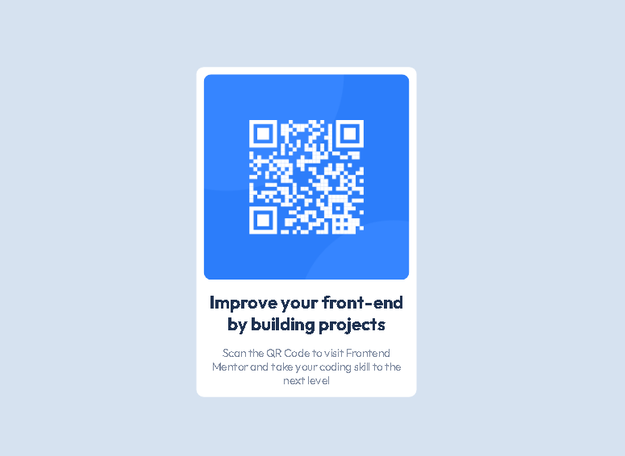

# Frontend Mentor - QR code component solution

This is a solution to the [QR code component challenge on Frontend Mentor](https://www.frontendmentor.io/challenges/qr-code-component-iux_sIO_H). Frontend Mentor challenges help you improve your coding skills by building realistic projects. 

## Overview

### Links

- Solution URL: [Github](https://github.com/nehru35/QR-Code-Component-Main)
- Live Site URL: [Netlify](https://your-live-site-url.com)

## My process

### Built with

- Semantic HTML5 markup
- CSS custom properties
- Flexbox
- Mobile-first workflow

## Author

- Website - [Nehrú André](https://nehruandre.netlify.app)
- Frontend Mentor - [@nehru35](https://www.frontendmentor.io/profile/nehru35)
- Twitter - [@nehru_andre](https://twitter.com/nehru_andre)
